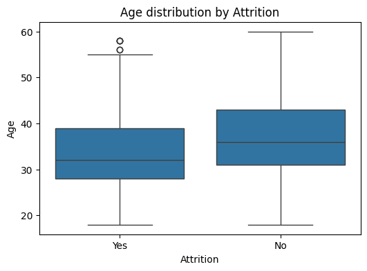
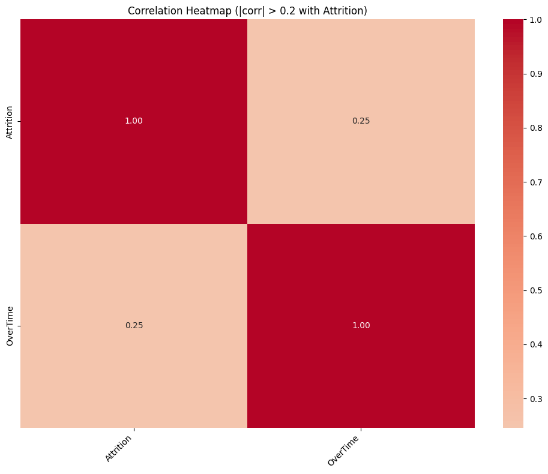
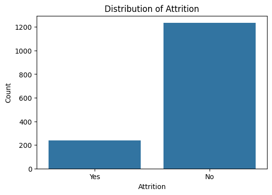
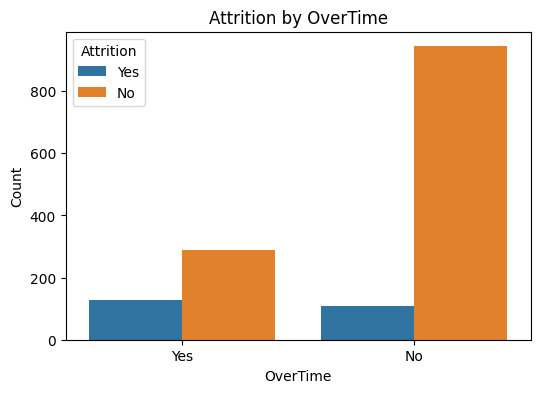
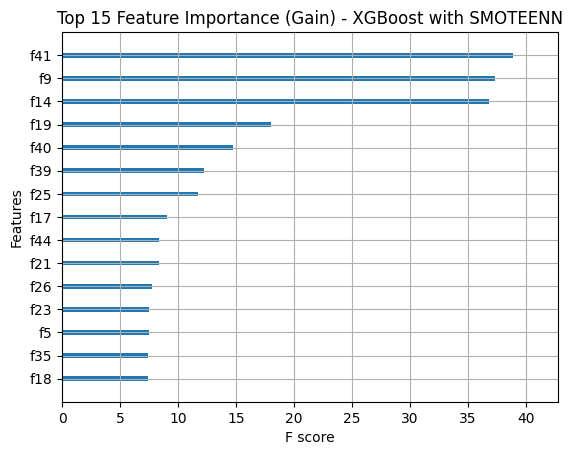
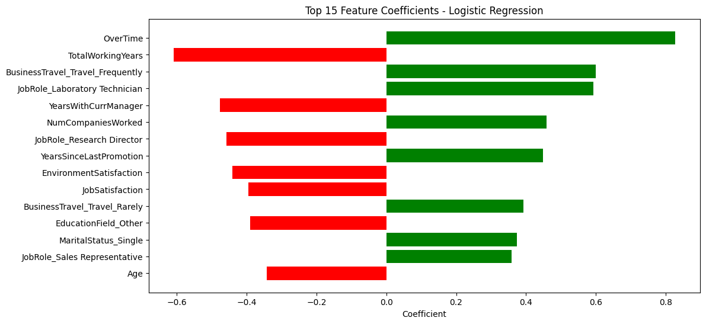
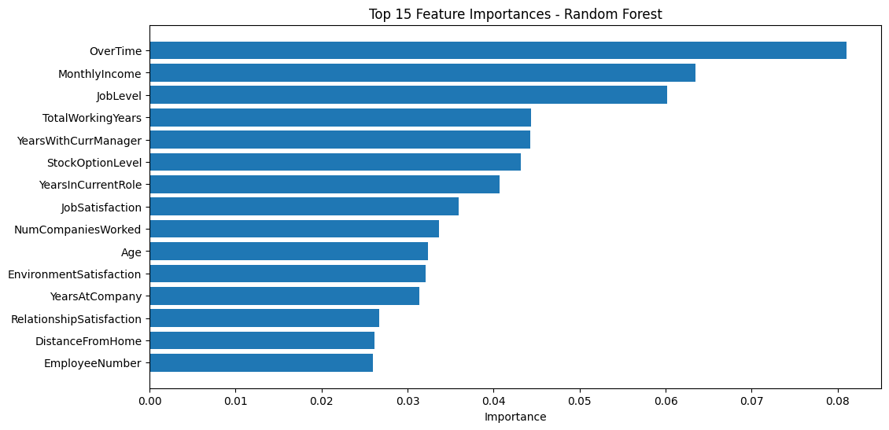
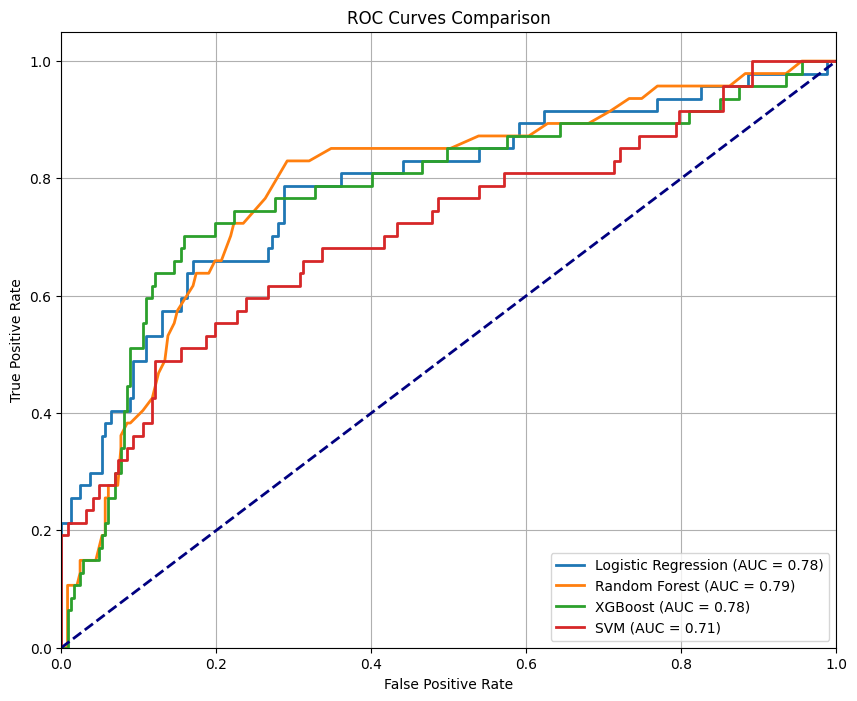

# Employee Attrition Prediction

## Overview

Employee attrition is a critical challenge for businesses worldwide. Predicting which employees are at risk of leaving helps companies take proactive measures, improve retention, and save costs related to recruitment and training.  

This project uses machine learning techniques to predict employee attrition based on historical data, uncovering key factors that influence turnover.

---

## Data Description

The dataset includes 1470 employees and 35 features ranging from personal demographics to job roles and satisfaction scores. Key variables include Age, Job Role, Overtime, Total Working Years, Relationship Satisfaction, and more.  
The target variable is **Attrition** (Yes/No), indicating whether the employee left the company.

---

## Exploratory Data Analysis (EDA)

- About 16% of employees in the dataset have left the company, indicating an imbalanced dataset.  
- Key categorical variables such as Job Role, Department, and Overtime were explored to understand distribution and potential impact on attrition.  
- Visualization showed younger employees tend to leave more, and employees working overtime have higher attrition rates.  
- Correlation heatmaps highlighted strong relationships between attrition and variables like Overtime and Job Role.

---

## Data Preprocessing

- Removed columns with no variance (e.g., Over18, EmployeeCount, StandardHours).  
- Converted categorical variables using encoding techniques (Label Encoding for binary, One-Hot Encoding for multiple categories).  
- Balanced the imbalanced dataset using techniques such as SMOTE and SMOTEENN to oversample the minority class.  
- Split data into training and testing sets (80/20 split).  
- Applied feature scaling to normalize numerical features.

---

## Model Training and Evaluation

Four machine learning models were trained and evaluated:

1. Logistic Regression  
2. Random Forest  
3. XGBoost  
4. Support Vector Machine (SVM)

Performance was measured using metrics including Accuracy, Precision, Recall, F1 Score, and ROC AUC.

---

### Key Results

| Model               | Accuracy | Precision | Recall | F1 Score | ROC AUC |
|---------------------|----------|-----------|--------|----------|---------|
| Logistic Regression  | 0.86     | 0.62      | 0.34   | 0.44     | 0.81    |
| Random Forest       | 0.84     | 0.44      | 0.09   | 0.14     | 0.76    |
| XGBoost             | 0.86     | 0.63      | 0.26   | 0.36     | 0.76    |
| SVM                 | 0.87     | 0.90      | 0.19   | 0.32     | 0.81    |

---

## Improving Recall

- To better detect employees likely to leave (higher recall), balancing techniques like SMOTEENN were applied.  
- Hyperparameter tuning with GridSearchCV optimized model performance.  
- Adjusting classification thresholds allowed a trade-off between recall and precision.  
- The best recall achieved was over 80% with XGBoost combined with SMOTEENN, enabling more proactive interventions.

---

## Feature Importance

Feature importance analysis revealed:

- Job roles like Sales Executive and Research Scientist are critical factors.  
- Overtime work, job level, total working years, and relationship satisfaction significantly influence attrition risk.  
- Personal and work-life factors such as marital status, work-life balance, and satisfaction scores matter greatly.

### XGBoost Feature Importance

### Logistic Regression Feature Coefficients

### Random Forest Feature Importance

---

## ROC Curves

ROC curves compare the models’ ability to discriminate between employees who leave and stay. Random Forest and Logistic Regression performed best, with areas under the curve around 0.78-0.79.

---

## Conclusion

This project demonstrates the power of data-driven approaches in tackling employee attrition. Understanding key drivers and leveraging predictive models allows companies to identify high-risk employees early and design effective retention strategies.  
By combining thorough data preprocessing, advanced balancing techniques, and robust machine learning models, we achieve a predictive system that balances accuracy with the practical need to catch as many potential attrition cases as possible.

---

## Next Steps

- Deploy the model in a real-time HR system.  
- Expand features with more granular employee engagement data.  
- Experiment with ensemble methods combining multiple models.  
- Create interactive dashboards for HR teams.
